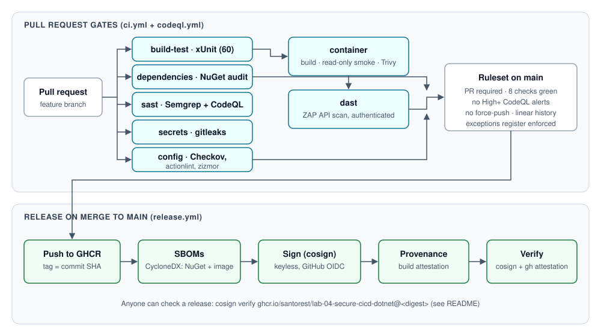

# Lab 04 — Secure CI/CD pipeline for a .NET API

[](https://github.com/santorest/lab-04-secure-cicd-dotnet/actions/workflows/ci.yml)
[](https://github.com/santorest/lab-04-secure-cicd-dotnet/actions/workflows/codeql.yml)
[](https://github.com/santorest/lab-04-secure-cicd-dotnet/actions/workflows/release.yml)

A small ASP.NET Core ticketing API and a GitHub Actions pipeline that checks every pull request (build and
tests, vulnerable dependencies, SAST, secrets, workflow/Dockerfile configuration, container CVEs, authenticated
DAST) and releases `main` as a signed container image with SBOMs and build provenance.

**Status: completed.** Everything ran on GitHub-hosted runners; the results in the write-up come from those
runs ([results/results.json](results/results.json)). Read the full write-up: [WRITEUP.md](WRITEUP.md)
(Spanish: [WRITEUP.es.md](WRITEUP.es.md)).



## Verify a release

```bash
cosign verify ghcr.io/santorest/lab-04-secure-cicd-dotnet@<digest> \
  --certificate-identity-regexp '^https://github.com/santorest/lab-04-secure-cicd-dotnet/.github/workflows/release.yml@refs/heads/main$' \
  --certificate-oidc-issuer https://token.actions.githubusercontent.com
gh attestation verify oci://ghcr.io/santorest/lab-04-secure-cicd-dotnet@<digest> --owner santorest
```

## Layout

```
src/TicketApi/                      API (minimal APIs, EF Core + SQLite, JWT, hardening)
tests/                              unit, integration (WebApplicationFactory) and repo-policy tests
.github/workflows/                  ci.yml (PR gates), codeql.yml, release.yml
.github/rulesets/main.json          branch ruleset for main
security/EXCEPTIONS.md              exceptions register (enforced by tests/RepoPolicy.Tests)
docs/demo-prs.md                    what each [demo] pull request tripped
tools/collect_results.py            results from the public GitHub API -> results/results.json
```

Run locally: .NET 10 SDK, then `dotnet test`. Run the API: set `Jwt__SigningKey` to a base64 key of at least
32 bytes, then `dotnet run --project src/TicketApi`.

License: MIT.
